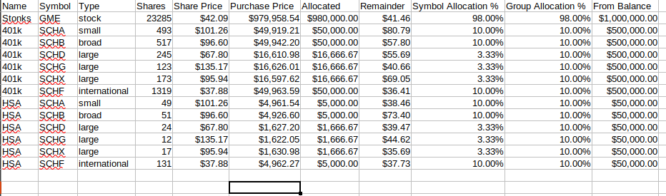

# Go Stocks

Allows you to split stocks according to portfolio allocations that you can customize. Writes the portfolios to a CSV file so you can use it with other things.

Leverages the Yahoo Finance API to get you a close-to-actual balance. Now you can invest a bit more wisely!

## Table of Contents

- [Go Stocks](#go-stocks)
  - [Table of Contents](#table-of-contents)
  - [Disclaimers](#disclaimers)
  - [Usage example](#usage-example)
  - [Creating your own config](#creating-your-own-config)
  - [Attributions](#attributions)
  - [TODO](#todo)

## Disclaimers

**This code is not production-level code. It is not unit tested (yet). Please review, in detail, every single result from this program before making decisions.**

**Do not use this as a substitute for making investment decisions. I am not responsible for your investment choices.**

**Do not spam the Yahoo Finance API by running this program repeatedly.** By default, it tries to only execute a single API call each time the program is run. **The Yahoo Finance API is offered to the world FREE, so DO NOT abuse it.**

## Usage example

Requires Go 1.15 or newer. To install, [click here and follow the instructions](https://golang.org/doc/install).

```bash
go get -v
go build -v
CONFIG=./res/example.config.yml ./goinvest
```

Output:

```
2021/02/19 09:20:41 symbols: GME,SCHA,SCHB,SCHD,SCHF,SCHG,SCHX
2021/02/19 09:20:41 quote: GME 42.0854
2021/02/19 09:20:41 quote: SCHA 101.256
2021/02/19 09:20:41 quote: SCHB 96.6
2021/02/19 09:20:41 quote: SCHD 67.7999
2021/02/19 09:20:41 quote: SCHF 37.8799
2021/02/19 09:20:41 quote: SCHG 135.1708
2021/02/19 09:20:41 quote: SCHX 95.94
2021/02/19 09:20:41 done: finished writing  to ./output/investments-example.csv
```

Open `./output/investments-example.csv` to see:



## Creating your own config

Create a configuration file anywhere you want, but preferably in `./res/config.yml`.

The example configuration file `./res/example.config.yml` contains everything you need, but here are some more specifics:

* A `portfolio` is an investment strategy that should consume either a portion of or an entire financial account that you own, or multiple accounts. An example of this would be for retirement accounts that you own and invest in the exact same way, but split across multiple financial institutions (and you cannot consolidate them). Creating one `portfolio` and assigning that portfolio to multiple `balances` (accounts) is the ideal way to leverage this feature.
* Each `portfolio` that you add must have a `name`, which must be referenced by a `balance`.
* Each `symbol` under a `portfolio` must have a `type`; this is an arbitrary keyword/tag that you want to associate with that symbol. A portfolio's `allocations` section will then split a `balance` up *evenly* for multiple stocks with the same `type`.
  * Example: `ABC` and `XYZ` have type `small`, and `DEF` has the type `large`. A `portfolio` has a `balance` of `1000`. The portfolio's allocations are set to `small` and `large` at `50.0` and `50.0`. The result allocation is that `ABC=$250`, `XYZ=$250`, AND `DEF=$500`.

## Attributions

* Shamelessly uses source code directly from [achannarasappa/ticker](https://github.com/achannarasappa/ticker), as a result this repository is licensed GPL-3.0.
* Yahoo Finance API

## TODO

* Dockerize this program.
* Add code to cleverly minimize remainders (I've implemented this previously in Python, need to port the code to Go)
* Unit tests
* Integration with Plaid
* SPDX license identifiers
